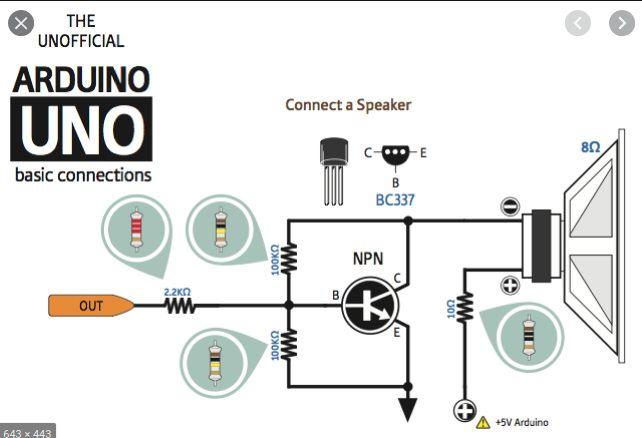

# alarm_velo

## Simple Bike alarm 

Made with a esp8266 wemos d1 mini and a MPU6050

Libraries extracted from : https://github.com/jrowberg/i2cdevlib
just extract the ic2dev and mpu6050 libraries from the arduino repertory

